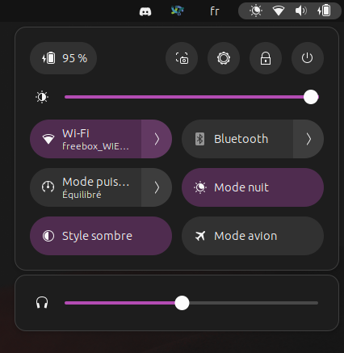
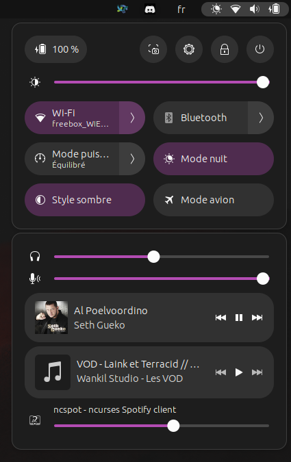
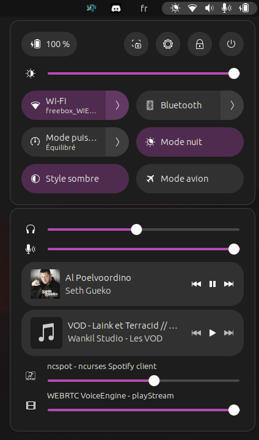
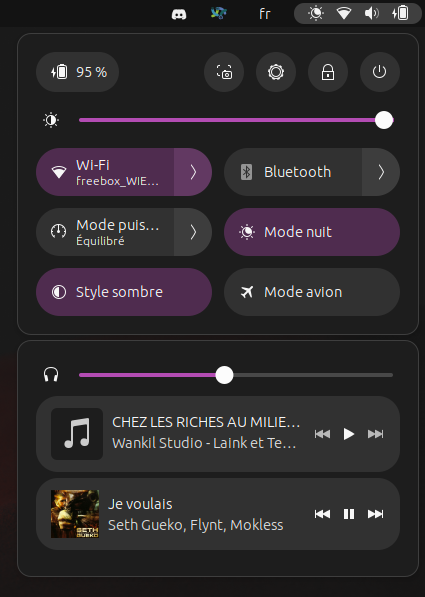
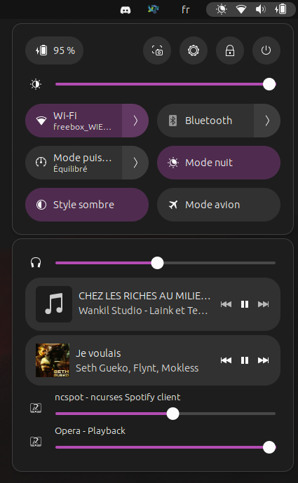
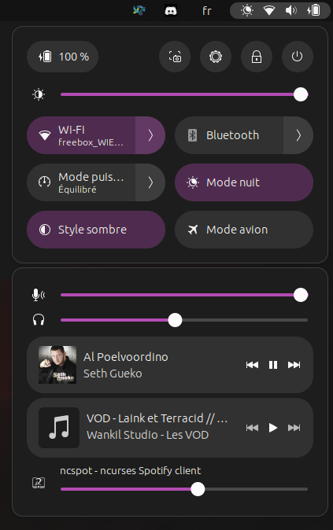

Quick Settings Audio Panel
==========================

Quick Settings Audio Panel is a gnome 44+ extension that creates a new panel for sound related stuff in the Quick Settings.

Features
--------
| Feature | Render |
|:--------|:------:|
| Move master volume sliders (speaker / headphone and microphone) to the new panel |  |
| Always show the microphone volume slider, but the icon in the top don't change behavior ! |   |
| Move (or duplicate) media controls into this panel |  |
| Create an application mixer |  |
| You can also reorder everything the way you like |   |

Notice
------

When changing the settings, it is necessary to disable and re-enable the extension for the changes to take effect.

Compatibility
-------------

As it's heavily inspired by it, this plugin is mostly incompatible with Quick Settings Tweaks. However, as long as you don't enable features that try to do the same thing, it should work.

~~The only unavoidable issue is that disabling Quick Settings Tweaks will cause it to crash, and you'll have to restart gnome shell if you want to re-enable it.~~ (not caused by this extension)

Known incompatibilities are:
  - Both volume mixers can be activated at the same time, even if it doesn't make sense
  - Both media controls can be activated at the same time, even if it doesn't make sense
  - Everything in the `Input/Output` tab of Quick Settings Tweaks won't work if you enable `Move master volume sliders`. However, no crash should be observed
  - `Remove Media Control on Date Menu` (but not `Remove Notifications On Date Menu`) will remove the media controls from the sound panel if you **move** the media controls using this extension. If you **duplicate** the media controls with the extension, they will not be affected
  - "Always show microphone volume slider" **won't work** if Quick Settings Tweaks is enabled, I'll make a pull request on their side to fix this issue