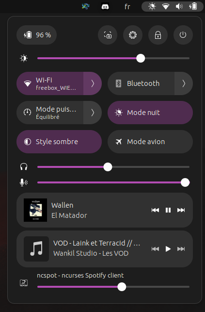
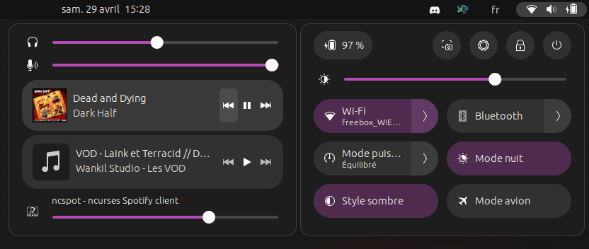
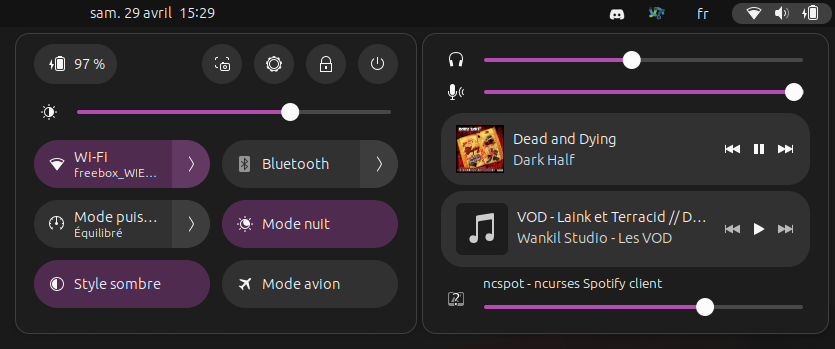
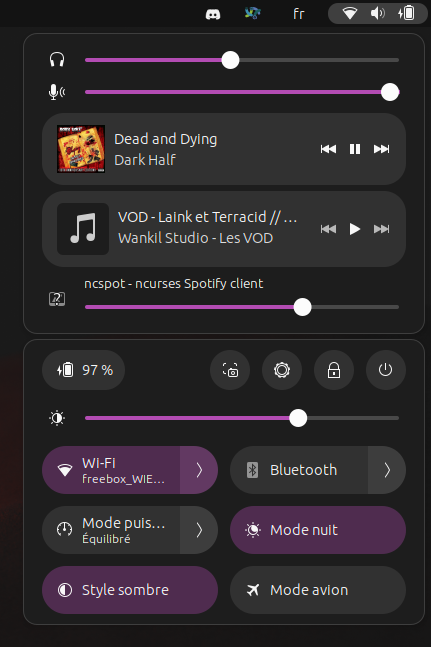
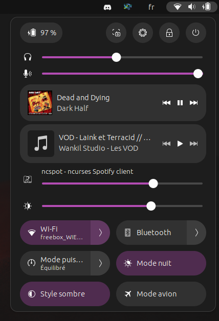

Quick Settings Audio Panel
==========================

Quick Settings Audio Panel is a gnome 44+ extension that creates a new panel for sound related stuff in the Quick Settings.

Features
--------
|  |  |  |
|:--:|:--:|:--:|
| Move master volume sliders (speaker / headphone and microphone) to the new panel | Always show the microphone volume slider, but the icon in the top don't change behavior ! | Move (or duplicate) media controls into this panel |
|  |  |  |
| Create an application mixer | You can also reorder everything the way you like | If you want to, you can even merge the new panel into the main one |
|  |  | |
| The panel can be (almost) wherever you want ! | It's more limited on merged panel though | |

Notice
------

When changing the settings, it is necessary to disable and re-enable the extension for the changes to take effect.

**The layout will be completly broken if you merge the sound panel in the main one with an horizontal layout** (everything works correctly but it looks terrible).

The Bluetooth menu is overflowing on the other quick settings below. It's a known issue that is also present in the original panel, and I can't fix it.

Compatibility
-------------

As it's heavily inspired by it, this plugin is mostly incompatible with Quick Settings Tweaker. However, as long as you don't enable features that try to do the same thing, it should work.

Known incompatibilities are:
  - Both volume mixers can be activated at the same time, even if it doesn't make sense
  - Both media controls can be activated at the same time, even if it doesn't make sense
  - Everything in the `Input/Output` tab of Quick Settings Tweaker won't work if you enable `Move master volume sliders`. However, no crash should be observed
  - `Remove Media Control on Date Menu` (but not `Remove Notifications On Date Menu`) will remove the media controls from the sound panel if you **move** the media controls using this extension. If you **duplicate** the media controls with the extension, they won't be affected
  - If you meet these conditions:
    - The sound panel is separated from the main one
    - You're using an horizontal layout (sound panel at left or right of the main panel) 
    - The notifications are in their own panel

    Then the notification panel will be really narrow and will be a little bit too tall

On Gnome Shell 43, compatibility with Quick Settings Tweaker has not been tested.
